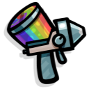
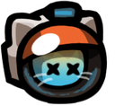
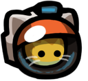

<h1>
     NinePatch
</h1>

    The NinePatch mod API allows you to easily add new items and sprites to the popular space exploration game, MewnBase. With this API, you can create your own <ins>custom items</ins> and add them to the game, along with <ins>unique sprites</ins>.

 
<h1>
     Using
</h1>

    To get started, you will need add to Gradle dependencies NinePatch mod API. Once you have done this, you can start creating your own <ins>custom items</ins>. You can do this by using the API built-in tools to define your item's properties, such as its name and sprite for this moment. For fast start you can use example template from GitHub.
     
     
    Adding dependence and jitpack to Gradle:

    repositories {
    	mavenCentral()
    	maven { url 'https://jitpack.io' }
    }

    dependencies {
		implementation 'com.github.MeiNanziiii:NinePatch:0.55'
    }

<h1>
     Contributors
</h1>

    <b>MeiNanziiii#5309</b> - Main author

    Contributions are always welcome and appreciated! Whether it's a bug report, feature suggestion, code contribution, or just a small improvement, your help can make a difference. Don't be shy and join the community to help improve the project together!
     
     

<h1>
     Discord server!
</h1>

    If you want join the community, you can join the Discord server! https://discord.gg/bMxbuDjbBh

